# Laravel Authentication

## 📌 Features Implemented  

### 🔐 Authentication Features  
- Login via **Email or Phone**  
- User Registration  
- Logout & Logout from All Devices  
- Password Reset & Change Password  
- Account Verification via **Email or Phone OTP**  
- Social Login (**Google, Facebook, GitHub**)  
- Passwordless Authentication (**Magic Link or OTP**)  
- User Profile Management  
- Control Active Sessions on Multiple Devices

### 🔒 Access Control & User Management  
- Role & Permission Management  
- Admin Panel for User Management  

### 🛠️ API Endpoints  
- Login, Register, Logout  
- User Profile 
- Token Refresh for Persistent Authentication  


## 🚀 Images

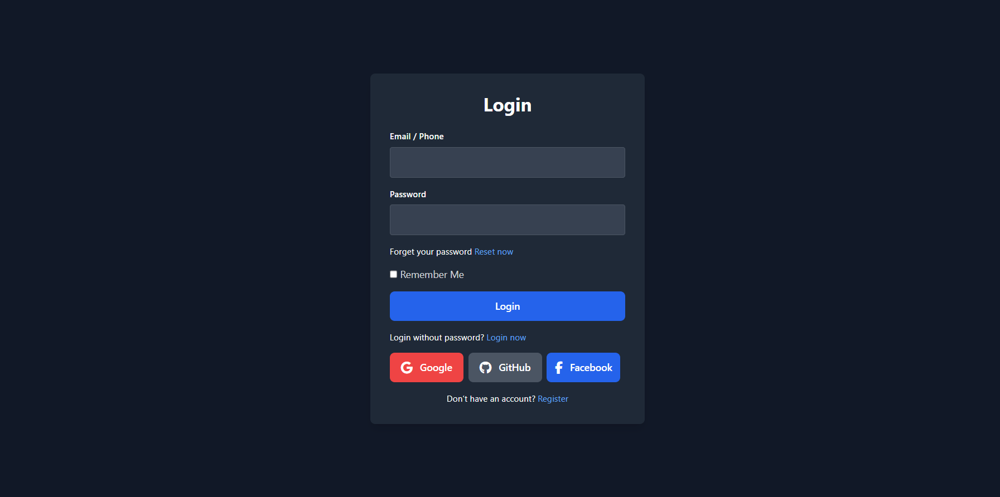
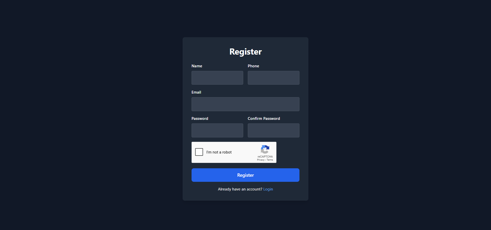
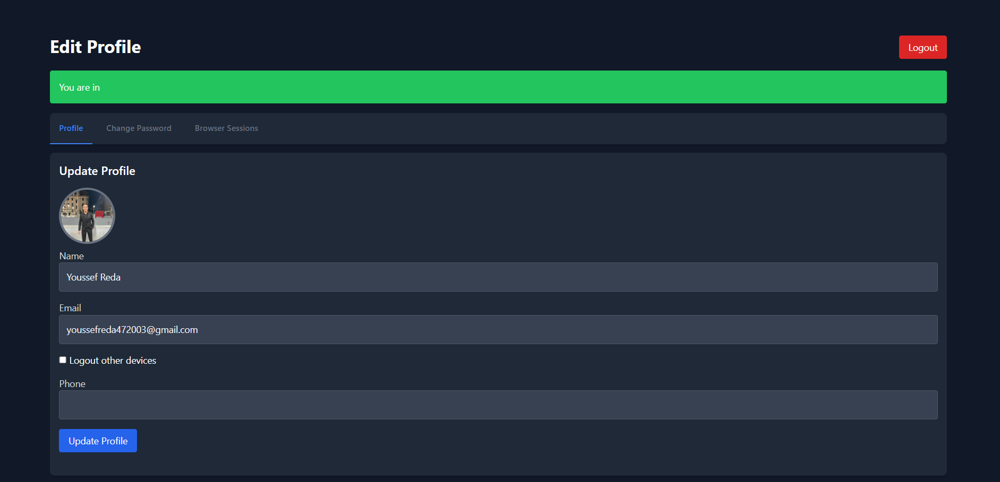
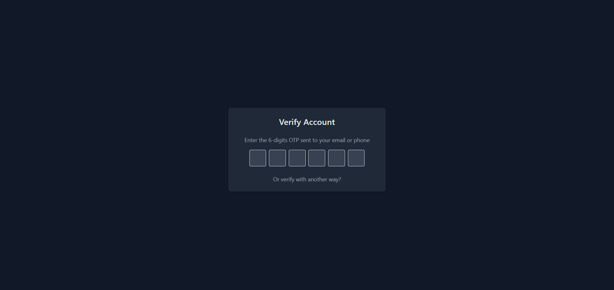
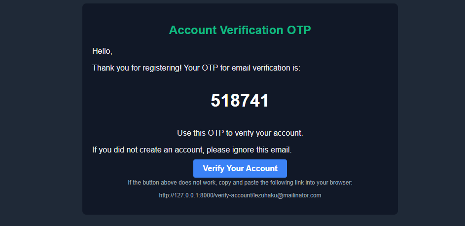
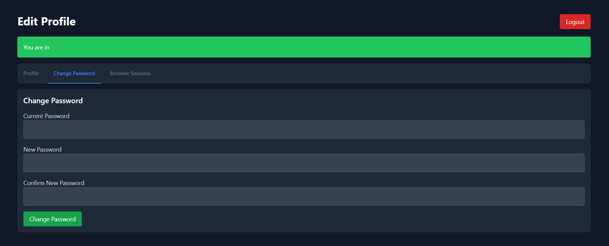
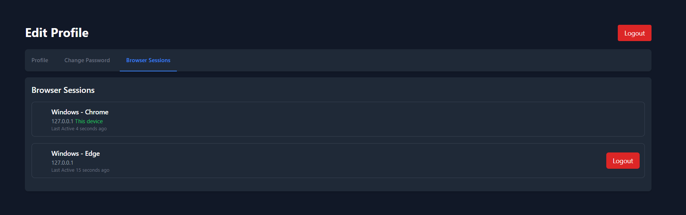
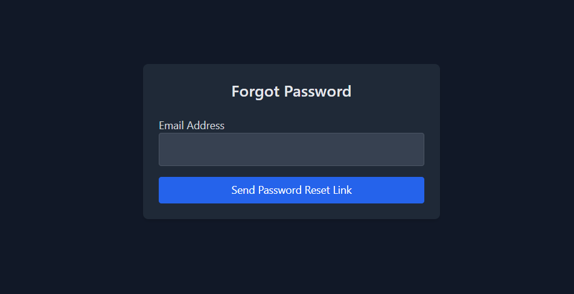
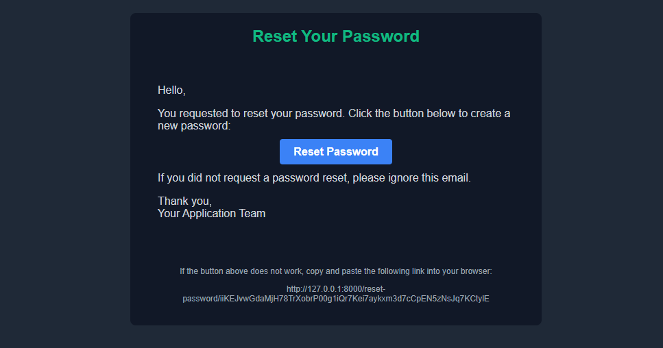
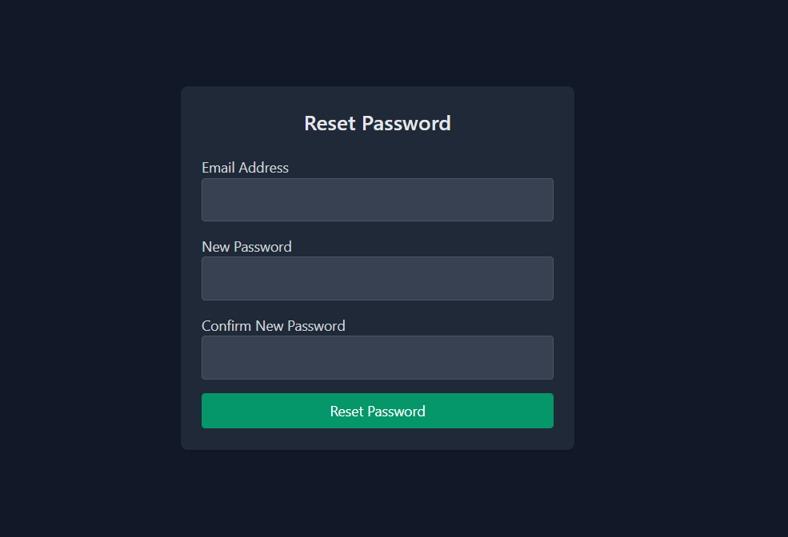
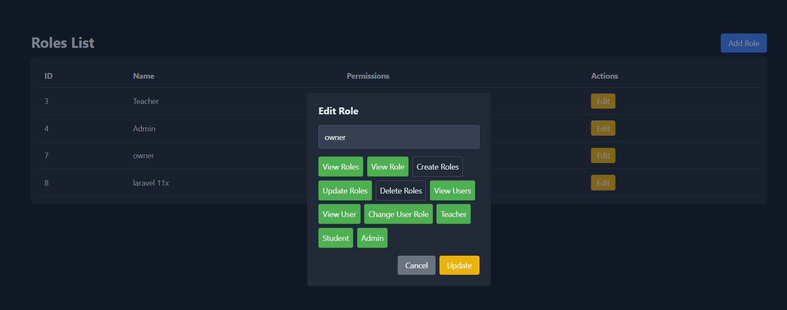
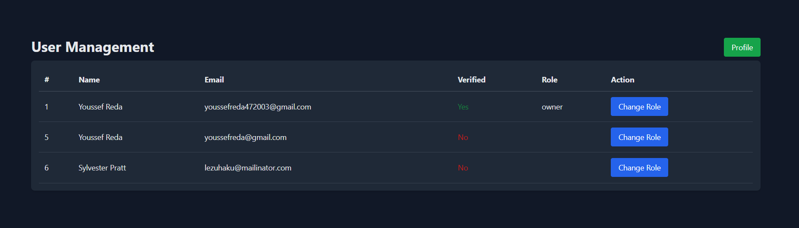


## 🚀 How to Use This Repo  

1. **Clone the repository**  
   ```bash
   git clone https://github.com/youssefreda4/authentication-project.git

2. Install dependencies:  
   ```bash
   composer install
   ```

3. Set up configurations:  
   ```bash
   cp .env.example .env
   ```

4. Generate App Key
   ```bash
   php artisan key:generate
   ```

5. Set up the database (SQLITE):  
   ```bash
   php artisan migrate
   ```

6. Start the development server:  
   ```bash
   php artisan serve
   ```

7. Access the app in your browser at `http://localhost:8000`.

